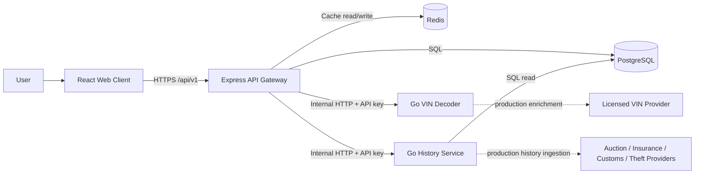
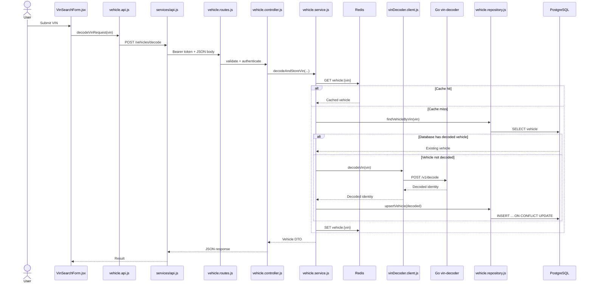
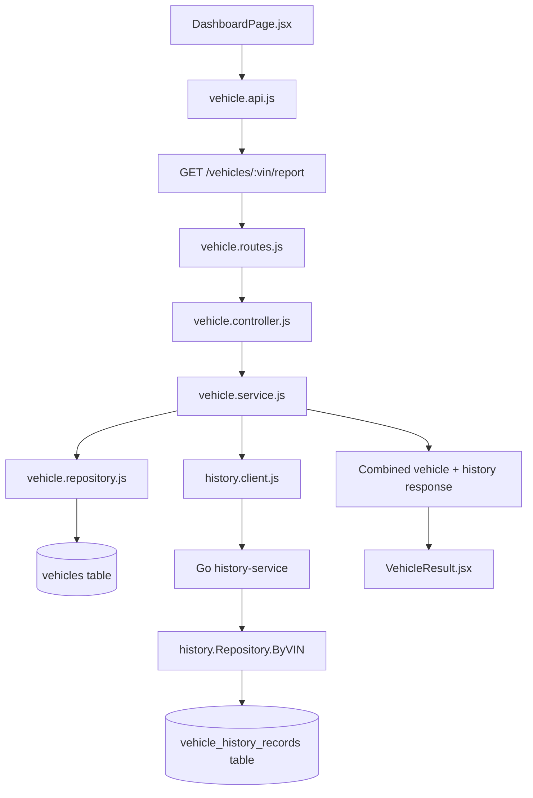
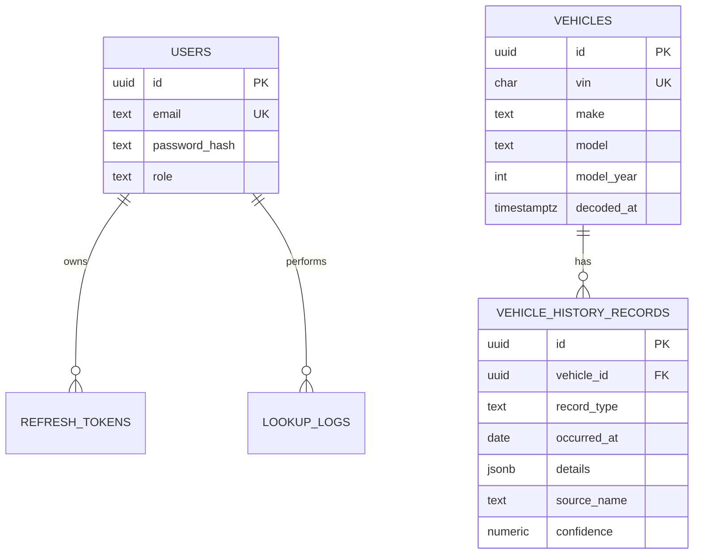
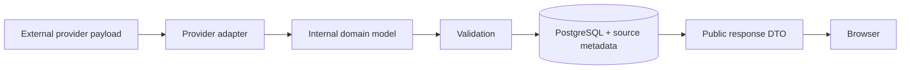

# Colvin — Visual Architecture and Production Guide

This guide explains **what calls what**, **where data moves**, and **which files must change before production**.

---

## 1. The system in one picture



### The most important rule

The browser communicates **only** with the Express API gateway.

It must never connect directly to:

- PostgreSQL;
- Redis;
- either Go service;
- a paid vehicle-data provider whose secret key would become visible in the browser.

---

## 2. Request path: decoding a VIN

When a user submits a VIN, the files execute in this order:



### Files involved

| Layer                 | File                                                      | Responsibility                                       |
| --------------------- | --------------------------------------------------------- | ---------------------------------------------------- |
| React UI              | `apps/web-client/src/features/vehicle/VinSearchForm.jsx`  | Captures and submits the VIN.                        |
| React API wrapper     | `apps/web-client/src/features/vehicle/vehicle.api.js`     | Defines the public endpoint call.                    |
| Axios infrastructure  | `apps/web-client/src/services/api.js`                     | Adds access token and refreshes expired sessions.    |
| Express route         | `apps/api-gateway/src/routes/vehicle.routes.js`           | Defines endpoint, auth and validation middleware.    |
| Express controller    | `apps/api-gateway/src/controllers/vehicle.controller.js`  | Converts HTTP request into a service call.           |
| Express orchestration | `apps/api-gateway/src/services/vehicle.service.js`        | Coordinates cache, database, Go service and logging. |
| Redis connection      | `apps/api-gateway/src/cache/redis.js`                     | Creates the Redis client.                            |
| Go client             | `apps/api-gateway/src/clients/vinDecoder.client.js`       | Makes the private HTTP request to Go.                |
| Go handler            | `apps/services-go/vin-decoder/internal/httpapi/server.go` | Receives `/v1/decode`.                               |
| Go domain logic       | `apps/services-go/vin-decoder/internal/vin/decoder.go`    | Validates and decodes the VIN.                       |
| PostgreSQL repository | `apps/api-gateway/src/repositories/vehicle.repository.js` | Executes parameterized vehicle queries.              |
| Database schema       | `database/migrations/001_init.sql`                        | Defines `vehicles` and lookup tables.                |

---

## 3. Request path: loading the full vehicle report



The history service currently **reads stored history**. It does not yet download accident, auction, customs, mileage or theft records from an external provider.

---

## 4. Folder map in plain English

```text
colvin/
│
├── apps/
│   ├── web-client/                  Browser application
│   │   └── src/
│   │       ├── app/                 Top-level routing
│   │       ├── components/          Shared visual components
│   │       ├── features/auth/       Login, registration and session UI
│   │       ├── features/vehicle/    VIN search and report UI
│   │       ├── services/            Axios and token storage
│   │       └── styles/              Global styling
│   │
│   ├── api-gateway/                 Only public backend
│   │   └── src/
│   │       ├── routes/              URL + middleware mapping
│   │       ├── controllers/         HTTP adapter layer
│   │       ├── services/            Application orchestration
│   │       ├── repositories/        PostgreSQL access
│   │       ├── clients/             Calls private Go services
│   │       ├── validators/          Zod request schemas
│   │       ├── middleware/          Auth, errors and validation
│   │       ├── cache/               Redis connection
│   │       ├── database/            PostgreSQL pool
│   │       ├── config/              Environment and logger
│   │       └── utils/               Tokens, hashes and helpers
│   │
│   └── services-go/
│       ├── vin-decoder/             VIN validation and identity decoding
│       └── history-service/         History retrieval and future ingestion
│
├── database/migrations/             PostgreSQL schema
├── docker-compose.yml               Local service wiring
├── .env.example                     Required environment variables
└── docs/                             Human-readable architecture guides
```

---

## 5. How frontend files map to backend files

| User action     | Frontend starting file | Frontend API file         | Gateway endpoint            | Gateway orchestration | Internal/data dependency          |
| --------------- | ---------------------- | ------------------------- | --------------------------- | --------------------- | --------------------------------- |
| Register        | `RegisterPage.jsx`     | `auth.api.js`             | `POST /auth/register`       | `auth.service.js`     | `user.repository.js` → PostgreSQL |
| Log in          | `LoginPage.jsx`        | `auth.api.js`             | `POST /auth/login`          | `auth.service.js`     | bcrypt + JWT + PostgreSQL         |
| Refresh session | `services/api.js`      | direct Axios refresh call | `POST /auth/refresh`        | `auth.service.js`     | hashed refresh-token table        |
| Decode VIN      | `VinSearchForm.jsx`    | `vehicle.api.js`          | `POST /vehicles/decode`     | `vehicle.service.js`  | Redis → Go decoder → PostgreSQL   |
| Load report     | `DashboardPage.jsx`    | `vehicle.api.js`          | `GET /vehicles/:vin/report` | `vehicle.service.js`  | PostgreSQL + Go history service   |
| Render result   | `VehicleResult.jsx`    | receives API result       | no new endpoint             | no new service        | presentation only                 |

Do **not** import backend JavaScript into React. The correct integration is:

```js
// Frontend imports its own HTTP wrapper.
import { decodeVinRequest } from './vehicle.api.js';

const result = await decodeVinRequest(vin);
```

That wrapper calls the backend:

```js
// apps/web-client/src/features/vehicle/vehicle.api.js
import api from '../../services/api.js';

export async function decodeVinRequest(vin) {
  const response = await api.post('/vehicles/decode', { vin });
  return response.data.data;
}
```

The Express route then maps the request to its controller:

```js
// apps/api-gateway/src/routes/vehicle.routes.js
router.post('/decode', authenticate, validate({ body: decodeVinSchema }), decodeVinController);
```

---

## 6. Production replacement map

The repository runs locally, but the following areas contain starter or development implementations.

### Priority 1 — replace the small local VIN map

**Current file**

```text
apps/services-go/vin-decoder/internal/vin/decoder.go
```

**Current behavior**

- validates 17-character VINs;
- checks forbidden characters;
- calculates the check digit;
- recognizes only a small WMI map;
- does not reliably return model, model year, engine or body class.

**Production change**

Keep local validation, then add a provider abstraction:

```text
vin-decoder/internal/provider/provider.go
vin-decoder/internal/provider/http_provider.go
vin-decoder/internal/config/config.go
```

Example interface:

```go
package provider

import "context"

type VehicleIdentity struct {
    Make         string
    Model        string
    ModelYear    *int
    Manufacturer string
    Country      string
    BodyClass    string
    Engine       string
}

type Decoder interface {
    Decode(ctx context.Context, vin string) (VehicleIdentity, error)
}
```

Example production HTTP provider with timeout and status checking:

```go
package provider

import (
    "context"
    "encoding/json"
    "fmt"
    "net/http"
    "net/url"
    "time"
)

type HTTPProvider struct {
    baseURL string
    apiKey  string
    client  *http.Client
}

func NewHTTPProvider(baseURL, apiKey string) *HTTPProvider {
    return &HTTPProvider{
        baseURL: baseURL,
        apiKey:  apiKey,
        client: &http.Client{Timeout: 8 * time.Second},
    }
}

func (p *HTTPProvider) Decode(ctx context.Context, vin string) (VehicleIdentity, error) {
    endpoint := p.baseURL + "/vehicles/decode?vin=" + url.QueryEscape(vin)
    req, err := http.NewRequestWithContext(ctx, http.MethodGet, endpoint, nil)
    if err != nil {
        return VehicleIdentity{}, fmt.Errorf("build provider request: %w", err)
    }

    req.Header.Set("Authorization", "Bearer "+p.apiKey)
    req.Header.Set("Accept", "application/json")

    response, err := p.client.Do(req)
    if err != nil {
        return VehicleIdentity{}, fmt.Errorf("VIN provider request: %w", err)
    }
    defer response.Body.Close()

    if response.StatusCode != http.StatusOK {
        return VehicleIdentity{}, fmt.Errorf("VIN provider returned status %d", response.StatusCode)
    }

    var payload struct {
        Make         string `json:"make"`
        Model        string `json:"model"`
        ModelYear    *int   `json:"modelYear"`
        Manufacturer string `json:"manufacturer"`
        Country      string `json:"country"`
        BodyClass    string `json:"bodyClass"`
        Engine       string `json:"engine"`
    }

    if err := json.NewDecoder(response.Body).Decode(&payload); err != nil {
        return VehicleIdentity{}, fmt.Errorf("decode provider response: %w", err)
    }

    return VehicleIdentity(payload), nil
}
```

Add environment variables such as:

```env
VIN_PROVIDER_BASE_URL=https://provider.example.com/api
VIN_PROVIDER_API_KEY=read-from-a-secret-manager
```

Never place this API key in `VITE_*` variables because Vite exposes those values to the browser bundle.

---

### Priority 2 — add real vehicle-history ingestion

**Current files**

```text
apps/services-go/history-service/internal/history/repository.go
apps/services-go/history-service/internal/httpapi/server.go
```

**Current behavior**

The service only runs a SQL query against `vehicle_history_records`. Empty database means empty history.

**Production change**

Add provider clients and an ingestion service:

```text
history-service/internal/provider/provider.go
history-service/internal/provider/auction.go
history-service/internal/provider/insurance.go
history-service/internal/provider/customs.go
history-service/internal/history/service.go
history-service/internal/history/repository.go
```

Example provider contract:

```go
package provider

import "context"

type Record struct {
    Type            string
    OccurredAt      *string
    Country         *string
    Summary         string
    Details         map[string]any
    SourceName      string
    SourceReference *string
    Confidence      float64
}

type HistoryProvider interface {
    Fetch(ctx context.Context, vin string) ([]Record, error)
}
```

Example orchestration logic:

```go
func (s *Service) Report(ctx context.Context, vin string) ([]Record, error) {
    stored, err := s.repository.ByVIN(ctx, vin)
    if err != nil {
        return nil, err
    }

    if len(stored) > 0 && s.isFresh(stored) {
        return stored, nil
    }

    records, err := s.provider.Fetch(ctx, vin)
    if err != nil {
        // A stale stored result can be safer than returning nothing.
        if len(stored) > 0 {
            return stored, nil
        }
        return nil, err
    }

    if err := s.repository.UpsertProviderRecords(ctx, vin, records); err != nil {
        return nil, err
    }

    return records, nil
}
```

In production, use a background job or message queue for slow multi-provider history searches rather than holding one HTTP request open indefinitely.

---

### Priority 3 — replace browser localStorage refresh-token storage

**Current file**

```text
apps/web-client/src/services/tokenStore.js
```

The starter keeps access and refresh tokens in browser storage for simplicity. This increases exposure if an XSS vulnerability occurs.

**Production recommendation**

- keep access token in memory;
- place refresh token in a `Secure`, `HttpOnly`, `SameSite` cookie;
- add CSRF protection when cross-site request conditions require it;
- rotate refresh tokens server-side.

Example Express cookie response:

```js
response.cookie('refresh_token', tokens.refreshToken, {
  httpOnly: true,
  secure: env.NODE_ENV === 'production',
  sameSite: 'strict',
  path: '/api/v1/auth',
  maxAge: 7 * 24 * 60 * 60 * 1000,
});

response.status(200).json({
  data: {
    user: tokens.user,
    accessToken: tokens.accessToken,
  },
});
```

Then configure Axios:

```js
const api = axios.create({
  baseURL: import.meta.env.VITE_API_BASE_URL,
  timeout: 10_000,
  withCredentials: true,
  headers: { 'Content-Type': 'application/json' },
});
```

This change also requires adjusting CORS in `apps/api-gateway/src/app.js` to allow credentials only from trusted origins.

---

### Priority 4 — use a real migration workflow

**Current implementation**

```text
database/migrations/001_init.sql
docker-compose.yml
```

Docker runs the SQL automatically only when PostgreSQL creates a fresh volume.

**Production change**

Use a dedicated migration job in CI/CD with tools such as:

- `node-pg-migrate` for Node;
- Goose or Atlas for Go;
- Flyway or Liquibase in polyglot environments.

Do not reset production databases with `docker compose down -v`.

---

### Priority 5 — move secrets out of `.env`

**Current file**

```text
.env.example
```

Local `.env` files are appropriate for development only.

Production values should come from a managed secret system, for example:

- AWS Secrets Manager;
- Google Secret Manager;
- Azure Key Vault;
- HashiCorp Vault;
- Kubernetes Secrets with encryption and external secret synchronization.

Replace these values before any deployment:

```env
POSTGRES_PASSWORD=
REDIS_PASSWORD=
JWT_ACCESS_SECRET=
JWT_REFRESH_SECRET=
INTERNAL_API_KEY=
VIN_PROVIDER_API_KEY=
HISTORY_PROVIDER_API_KEY=
```

---

### Priority 6 — strengthen private service authentication

**Current files**

```text
apps/api-gateway/src/clients/internalClient.js
apps/services-go/*/internal/httpapi/server.go
```

The starter uses one shared internal API key.

For production:

- place Go services on a private network;
- use mTLS, workload identity or signed service tokens;
- rotate credentials;
- do not expose Go ports through a public load balancer.

---

### Priority 7 — production observability

Add instrumentation around:

```text
apps/api-gateway/src/server.js
apps/api-gateway/src/services/vehicle.service.js
apps/services-go/*/cmd/server/main.go
```

Minimum production telemetry:

- request IDs propagated between Node and Go;
- structured logs;
- request latency;
- provider latency and error rates;
- cache hit ratio;
- database pool saturation;
- rate-limit events;
- authentication failures;
- distributed traces with OpenTelemetry.

Example request-ID propagation in the Node internal client:

```js
export function createInternalClient(baseURL) {
  return axios.create({
    baseURL,
    timeout: 8_000,
    headers: {
      'x-internal-api-key': env.INTERNAL_API_KEY,
    },
  });
}

export async function decodeVin(vin, requestId) {
  return client.post('/v1/decode', { vin }, { headers: { 'x-request-id': requestId } });
}
```

---

## 7. Database ownership



### Recommended service ownership

- API gateway owns `users`, `refresh_tokens`, `lookup_logs` and the normalized `vehicles` record.
- History service owns reads and future writes for `vehicle_history_records`.
- VIN decoder should remain stateless unless a later requirement justifies its own persistence.

For a larger production system, give each service a separate database role with only the permissions it needs.

---

## 8. Where to make common changes

| Change required                     | File or folder                                           |
| ----------------------------------- | -------------------------------------------------------- |
| Change public API URL               | `.env` → `VITE_API_BASE_URL`                             |
| Add a React page                    | `apps/web-client/src/features/...` and `src/app/App.jsx` |
| Add a frontend API call             | feature-level `*.api.js` file                            |
| Add a public endpoint               | `api-gateway/src/routes`                                 |
| Validate endpoint input             | `api-gateway/src/validators`                             |
| Add HTTP request handling           | `api-gateway/src/controllers`                            |
| Add workflow/business orchestration | `api-gateway/src/services`                               |
| Add PostgreSQL queries              | `api-gateway/src/repositories` or history repository     |
| Add a new Go call from Node         | `api-gateway/src/clients`                                |
| Add a new Go endpoint               | service `internal/httpapi/server.go`                     |
| Add VIN-domain logic                | `vin-decoder/internal/vin`                               |
| Add history-domain logic            | `history-service/internal/history`                       |
| Add database tables/indexes         | new file under `database/migrations`                     |
| Change cache lifetime               | `api-gateway/src/services/vehicle.service.js`            |
| Change CORS/security middleware     | `api-gateway/src/app.js`                                 |
| Add environment variables           | `.env.example` and `api-gateway/src/config/env.js`       |
| Change local service wiring         | `docker-compose.yml`                                     |

---

## 9. Safe production integration pattern

A provider response should never be passed directly to the browser. Normalize it first.



Why this matters:

- providers rename fields;
- providers can return malformed data;
- multiple sources may disagree;
- sensitive fields may need removal;
- licensing may forbid redistributing raw payloads;
- confidence and source attribution should remain attached.

---

## 10. Recommended order of production work

1. Choose and legally review VIN and history providers.
2. Implement the VIN provider adapter in the Go decoder.
3. Add history provider adapters and normalized storage.
4. Move refresh tokens to secure HttpOnly cookies.
5. Adopt managed PostgreSQL and Redis with TLS.
6. Introduce formal migrations and CI/CD checks.
7. Replace the internal API key with workload identity or mTLS.
8. Add OpenTelemetry, metrics, alerts and backup testing.
9. Perform dependency, SAST, DAST and penetration testing.
10. Conduct privacy and data-retention review before exposing owner-related information.

---

## 11. Quick mental model

```text
React asks.
Express decides and coordinates.
Redis accelerates.
Go performs specialized domain work.
PostgreSQL preserves normalized truth.
External providers supply licensed evidence.
```
